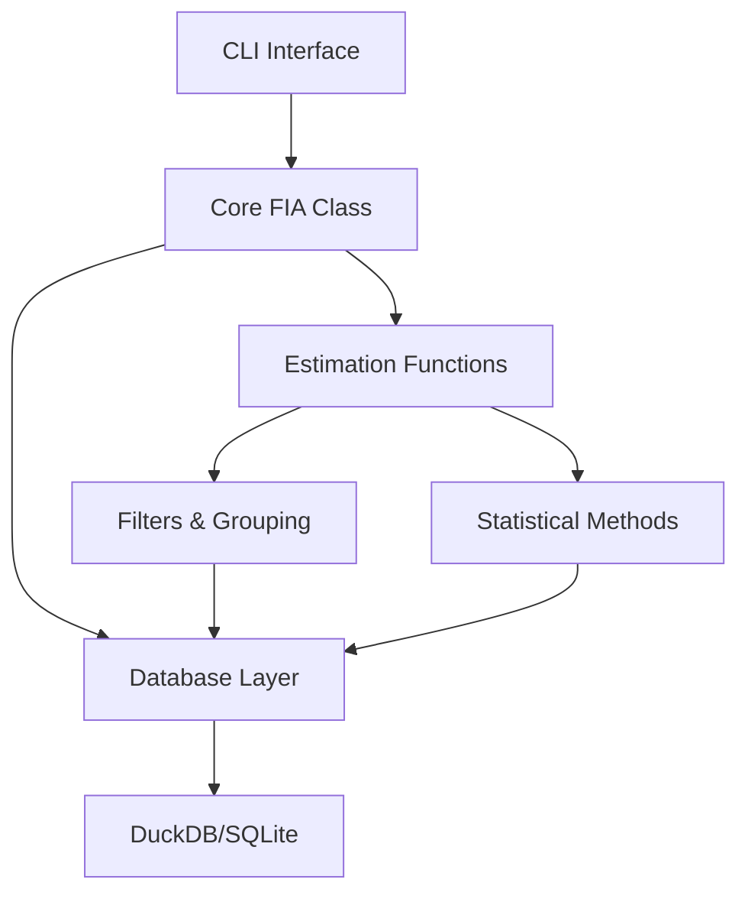

# Design Document

## Overview

This design outlines the refactoring of pyFIA to focus exclusively on programmatic functionality that mimics the rFIA package. The refactoring will remove all AI agent development code while preserving and enhancing the core statistical estimation capabilities for Forest Inventory and Analysis (FIA) data.

The refactored pyFIA will be a clean, focused Python library that provides direct equivalents to rFIA's statistical functions, maintaining the same validation accuracy while offering modern Python data processing capabilities through Polars and DuckDB.

## Architecture

### Current Architecture Analysis

The current codebase has the following structure:
- **Core FIA functionality**: `src/pyfia/core/`, `src/pyfia/estimation/`, `src/pyfia/filters/`
- **AI agent code**: `src/pyfia/ai/` (to be backed up and removed)
- **CLI interfaces**: `src/pyfia/cli/` (mixed AI and direct functionality)
- **Database layer**: `src/pyfia/database/`
- **Supporting modules**: `src/pyfia/models/`, `src/pyfia/locations/`, `src/pyfia/constants/`

### Target Architecture

The refactored architecture will focus on three main layers:

```
pyFIA Library
├── Core Layer (FIA class, data loading, EVALID management)
├── Estimation Layer (biomass, volume, tpa, area, mortality, growth)
├── Database Layer (query interface, schema mapping)
└── CLI Layer (direct database operations only)
```

### Component Relationships



## Components and Interfaces

### 1. Core FIA Class
**Location**: `src/pyfia/core/fia.py`
**Purpose**: Main interface for FIA data operations
**Key Methods**:
- `__init__(db_path, engine="duckdb")` - Database connection
- `find_evalid()` - EVALID discovery and filtering
- `clip_by_evalid()`, `clip_most_recent()` - EVALID selection
- `area()`, `biomass()`, `volume()`, `tpa()`, `mortality()` - Estimation methods
- `get_trees()`, `get_conditions()` - Data access methods

**Interface Stability**: Maintain existing API for backward compatibility

### 2. Estimation Functions
**Location**: `src/pyfia/estimation/`
**Purpose**: Statistical estimation methods matching rFIA functionality

**Core Functions**:
- `area(fia, method="TI", ...)` - Forest area estimation
- `biomass(fia, method="TI", component="TOTAL", ...)` - Biomass estimation  
- `volume(fia, method="TI", vol_type="NET", ...)` - Volume estimation
- `tpa(fia, method="TI", ...)` - Trees per acre estimation
- `mortality(fia, method="TI", ...)` - Mortality estimation
- `growth(fia, method="TI", ...)` - Growth estimation

**Parameter Patterns**: Match rFIA conventions
- `method`: Temporal estimation method (TI, annual, SMA, LMA, EMA)
- `by_species`: Group results by species
- `by_size_class`: Group by diameter classes
- `tree_type`: Filter by tree status (live, dead, gs, all)
- `land_type`: Filter by land classification (forest, timber, all)
- `tree_domain`, `area_domain`: Custom filtering expressions

### 3. Database Layer
**Location**: `src/pyfia/database/`
**Purpose**: Efficient data access and query optimization

**Components**:
- `query_interface.py` - SQL query generation and execution
- `schema_mapper.py` - FIA database schema handling
- `memory_docs/` - FIA documentation for reference

**Engine Support**:
- Primary: DuckDB (optimized for analytical workloads)
- Secondary: SQLite (compatibility and smaller datasets)

### 4. CLI Interface
**Location**: `src/pyfia/cli/`
**Purpose**: Direct command-line access to estimation functions

**Refactored Structure**:
- `direct.py` - Main CLI interface (keep existing functionality)
- `base.py` - Shared CLI utilities (remove AI references)
- `config.py` - Configuration management
- `utils.py` - Helper functions
- Remove: `ai_interface.py` (backup and delete)

### 5. Supporting Modules
**Locations**: Various
**Purpose**: Supporting functionality

**Keep As-Is**:
- `src/pyfia/filters/` - Domain filtering and grouping
- `src/pyfia/models/` - Data models and validation
- `src/pyfia/locations/` - Geographic utilities
- `src/pyfia/constants/` - FIA constants and mappings

## Data Models

### Input Data Models
- **FIA Database**: DuckDB or SQLite containing standard FIA tables
- **EVALID Selection**: List of evaluation IDs for statistical validity
- **Filter Expressions**: SQL-like expressions for custom filtering

### Output Data Models
- **Estimation Results**: Polars DataFrames with standardized columns
  - Estimates (e.g., `AREA`, `BIOMASS_ACRE`, `TPA`)
  - Standard errors (e.g., `AREA_SE`, `BIOMASS_ACRE_SE`)
  - Grouping variables (species, size class, etc.)
  - Metadata (YEAR, EVALID, plot counts)

### Validation Benchmarks
Maintain exact compatibility with existing validation results:
- Forest Area: EXACT MATCH with rFIA
- Biomass: EXACT MATCH with rFIA  
- Volume: EXACT MATCH with rFIA
- Trees per Acre: <4% difference (methodology confirmed)
- Mortality: Complete implementation validated

## Error Handling

### Database Connection Errors
- Clear error messages for missing database files
- Validation of database schema and required tables
- Graceful handling of connection timeouts

### Estimation Errors
- Validation of EVALID selection before estimation
- Clear error messages for missing required data
- Handling of edge cases (empty results, insufficient data)

### CLI Error Handling
- Input validation with helpful error messages
- Graceful handling of invalid parameters
- Recovery suggestions for common errors

## Testing Strategy

### Unit Tests
- **Estimation Functions**: Test each function with known inputs/outputs
- **Database Layer**: Mock database interactions and query generation
- **Filters**: Test domain filtering and grouping logic
- **CLI**: Test command parsing and parameter validation

### Integration Tests
- **End-to-End Workflows**: Complete estimation workflows with real data
- **Database Engines**: Test both DuckDB and SQLite backends
- **Cross-Platform**: Ensure compatibility across operating systems

### Validation Tests
- **rFIA Comparison**: Automated comparison with rFIA benchmark results
- **Regression Tests**: Ensure refactoring doesn't break existing functionality
- **Performance Tests**: Benchmark against current performance baselines

### Property-Based Tests
- **Statistical Properties**: Test estimation properties with generated data
- **Edge Cases**: Automatically discover edge cases in filtering logic
- **Data Consistency**: Verify data integrity across operations

## Migration Strategy

### Phase 1: Backup and Cleanup
1. Create backup branch for AI code preservation
2. Remove AI-related directories and files from main branch
3. Update imports and dependencies
4. Remove AI-related documentation

### Phase 2: Dependency Cleanup
1. Remove AI-related dependencies from `pyproject.toml`
2. Update optional dependencies structure
3. Remove AI-related CLI scripts
4. Update package metadata and description

### Phase 3: CLI Refactoring
1. Remove AI interface from CLI
2. Clean up base CLI class (remove AI references)
3. Update help text and documentation
4. Test direct CLI functionality

### Phase 4: Documentation Update
1. Update README.md to focus on rFIA compatibility
2. Remove AI agent documentation sections
3. Update examples to show rFIA-equivalent usage
4. Update installation instructions

### Phase 5: Testing and Validation
1. Run full test suite to ensure no regressions
2. Validate against existing rFIA benchmarks
3. Test CLI functionality end-to-end
4. Performance testing and optimization

## Implementation Considerations

### Backward Compatibility
- Maintain existing API for core estimation functions
- Preserve existing parameter names and conventions
- Keep validation accuracy at current levels
- Ensure existing user scripts continue to work

### Performance Optimization
- Leverage DuckDB's columnar storage for large datasets
- Optimize query patterns for common use cases
- Maintain efficient memory usage with Polars
- Consider caching strategies for repeated operations

### Code Quality
- Maintain existing code style and formatting
- Preserve comprehensive type hints
- Keep existing documentation standards
- Ensure all functions have proper docstrings

### Future Extensibility
- Design allows for easy addition of new estimation methods
- Modular structure supports new database backends
- CLI framework can accommodate new commands
- Plugin architecture for custom filters and groupings