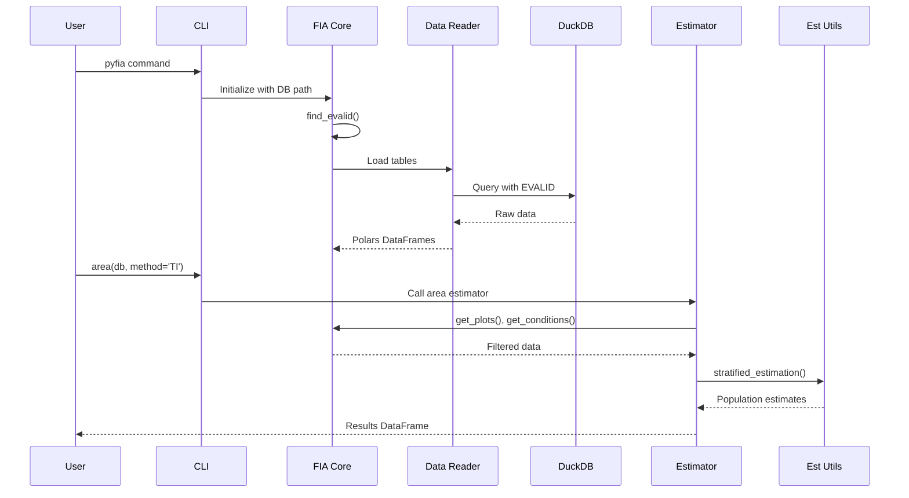

# CLAUDE.md

This file provides guidance to Claude Code (claude.ai/code) when working with code in this repository.

## Project Overview

pyFIA is a Python implementation for analyzing USDA Forest Inventory and Analysis (FIA) data using Polars for high performance and DuckDB for handling large-scale national datasets.

## Development Commands

### Python Package (pyFIA)

```bash
# Setup development environment (using uv)
uv venv
source .venv/bin/activate     # Unix/Mac
uv pip install -e .[dev]

# Install with different feature sets
uv pip install -e .                # Basic installation
uv pip install -e .[langchain]     # With AI agent support
uv pip install -e .[spatial]       # With spatial features (geopandas)
uv pip install -e .[all]          # All features

# Run tests
uv run pytest                      # Run all tests
uv run pytest --cov=pyfia         # With coverage reporting
uv run pytest tests/test_area.py  # Run specific test file
uv run pytest -k "test_tpa"       # Run tests matching pattern

# Code quality
uv run ruff format pyfia/ tests/   # Format code
uv run ruff check pyfia/ tests/    # Lint
uv run mypy pyfia/                 # Type check

# Documentation
mkdocs serve                       # Local documentation server
mkdocs build                       # Build static docs

# CLI Tools
pyfia                             # Direct API CLI
pyfia-ai path/to/database.duckdb  # AI-enhanced query CLI
```

### Benchmarking

```bash
# Run pyFIA benchmarks
cd pyFIA && uv run python benchmark_pyfia_optimized_v2.py
```

## Architecture Overview

### System Architecture Diagram

```mermaid
graph TB
    %% Define color scheme for dark mode
    classDef userInterface fill:#4a90e2,stroke:#fff,stroke-width:2px,color:#fff
    classDef coreComponent fill:#2ecc71,stroke:#fff,stroke-width:2px,color:#fff
    classDef dataLayer fill:#e74c3c,stroke:#fff,stroke-width:2px,color:#fff
    classDef aiComponent fill:#9b59b6,stroke:#fff,stroke-width:2px,color:#fff
    classDef estimator fill:#f39c12,stroke:#fff,stroke-width:2px,color:#fff
    classDef altEstimator fill:#e67e22,stroke:#fff,stroke-width:2px,color:#fff
    classDef utility fill:#34495e,stroke:#fff,stroke-width:2px,color:#fff
    classDef external fill:#95a5a6,stroke:#fff,stroke-width:2px,color:#fff

    %% User Interfaces
    CLI["CLI - Direct API"]:::userInterface
    CLIAI["CLI-AI - Natural Language"]:::userInterface
    API["Python API"]:::userInterface

    %% Core Components
    FIA["FIA Core Class"]:::coreComponent
    
    %% AI Components
    AIAgent["FIAAgent - Modern"]:::aiComponent
    DuckDBInterface["DuckDB Query Interface"]:::aiComponent

    %% Data Layer
    DataReader["FIA Data Reader"]:::dataLayer
    DuckDB[("DuckDB")]:::external

    %% Estimation Modules
    Area["Area Estimator"]:::estimator
    Biomass["Biomass Estimator"]:::estimator
    Volume["Volume Estimator"]:::estimator
    TPA["TPA Estimator"]:::estimator
    Mortality["Mortality Estimator"]:::estimator
    Growth["Growth Estimator"]:::estimator

    %% Utilities
    EstUtils["Estimation Utils"]:::utility
    Config["Config"]:::utility
    CLIConfig["CLI Config"]:::utility
    Models["Data Models"]:::utility
    SchemaMapper["DB Schema Mapper"]:::utility

    %% External Dependencies
    Polars["Polars DataFrames"]:::external
    LangChain["LangChain Framework"]:::external
    GeoPandas["GeoPandas"]:::external
    OpenAI["OpenAI API"]:::external

    %% Connections - User Layer
    CLI --> FIA
    CLIAI --> AIAgent
    API --> FIA

    %% Connections - AI Layer
    AIAgent --> DuckDBInterface
    AIAgent --> LangChain
    LangChain --> OpenAI
    DuckDBInterface --> DuckDB

    %% Connections - Core Layer
    FIA --> DataReader
    Area --> FIA
    Biomass --> FIA
    Volume --> FIA
    TPA --> FIA
    Mortality --> FIA
    Growth --> FIA

    %% Connections - Data Layer
    DataReader --> DuckDB
    DataReader --> Polars

    %% Connections - Estimators to Utils
    Area --> EstUtils
    Biomass --> EstUtils
    Volume --> EstUtils
    TPA --> EstUtils
    Mortality --> EstUtils
    Growth --> EstUtils
    EstUtils --> ratio_var["ratio_var()"]:::utility
    EstUtils --> cv["cv()"]:::utility

    %% Connections - Utilities
    FIA --> Config
    CLI --> CLIConfig
    CLIAI --> CLIConfig
    EstUtils --> Polars
    Area --> GeoPandas
    DuckDBInterface --> SchemaMapper

    %% Add labels for clarity
    subgraph UI["User Interfaces"]
        CLI
        CLIAI
        API
    end

    subgraph AI["AI Components"]
        AIAgent
        DuckDBInterface
    end

    subgraph Core["Core System"]
        FIA
    end

    subgraph Est["Estimation Modules"]
        Area
        Biomass
        Volume
        TPA
        Mortality
        Growth
    end

    subgraph Data["Data Access"]
        DataReader
        DuckDB
    end

    subgraph Utils["Utilities"]
        EstUtils
        Config
        CLIConfig
        Models
        SchemaMapper
        ratio_var
        cv
    end
```



### Data Flow Diagram



### Dual-Interface Design
pyFIA provides two distinct interfaces:
1. **Direct CLI (`cli.py`)**: Pure pyFIA API access for statistical analysis
2. **AI CLI (`cli_ai.py`)**: Natural language queries with SQL generation via LangChain/GPT-4

### Python Package Structure  
- `pyfia/core.py`: Main FIA class and common functionality
- `pyfia/data_reader.py`: Database interface for SQLite/DuckDB
- `pyfia/estimation_utils.py`: Shared estimation procedures and utilities
- Individual estimation modules for different metrics:
  - `area.py`: Forest area estimation
  - `biomass.py`: Biomass calculations
  - `volume.py`: Volume estimation
  - `tpa.py`: Trees per acre
  - `mortality.py`: Standard mortality estimation
  - `growth.py`: Growth estimation
- AI components:
  - `ai_agent.py`: Modern FIAAgent using 2025 LangChain patterns
  - `duckdb_query_interface.py`: Direct SQL interface for AI agents
- Utilities:
  - `models.py`: Pydantic data models
  - `db_schema_mapper.py`: Database schema utilities
  - `cli_config.py`: CLI configuration
  - `config.py`: General configuration

### Key Design Patterns

1. **Design-based estimation**: Following Bechtold & Patterson (2005) procedures
2. **Lazy evaluation**: Uses Polars lazy frames for memory efficiency
3. **Spatial support**: Integration with geopandas
4. **Database flexibility**: Support for both SQLite (testing) and DuckDB (production)
5. **EVALID-centric**: All data access filtered through evaluation system
6. **Stratified estimation**: Proper FIA statistical methodology

## Development Guidelines

- Use polars for all data manipulation
- Support DuckDB for large-scale national data processing
- Commit to git regularly throughout development (after each significant change or feature)
- All estimation functions should support:
  - Temporal queries (by year)
  - Spatial queries (by polygon)
  - Domain specifications (treeDomain, areaDomain)
  - Grouping variables (grpBy, bySpecies, bySizeClass)
- Include comprehensive tests for new functionality
- Document all public functions with examples

## Git Commit Strategy

### Commit Pattern for Progress Stages

For each major development task, create focused commits that represent logical progress stages:

1. **Feature Implementation**: Add core functionality
2. **Validation**: Compare with rFIA ground truth  
3. **Documentation**: Update CLAUDE.md with results
4. **Cleanup**: Remove temporary files and artifacts

### Commit Message Format

```
<type>: <short description>

<detailed description>
- Key changes
- Validation results
- Impact on codebase

Co-Authored-By: Claude <noreply@anthropic.com>
```

### Commit Types

- **feat**: New estimator or major feature
- **fix**: Bug fixes
- **docs**: Documentation updates
- **test**: Add or update tests
- **refactor**: Code restructuring
- **chore**: Maintenance and cleanup
- **validate**: Validation against rFIA

### Example Workflow

```bash
# 1. Implement feature
git add pyfia/new_estimator.py
git commit -m "feat: add mortality estimation module

- Implement mortality estimator following rFIA methodology
- Support for live/dead tree filtering
- EVALID-based filtering integrated

Co-Authored-By: Claude <noreply@anthropic.com>"

# 2. Validate against rFIA
git add validation_results.md
git commit -m "validate: mortality estimator against rFIA ground truth

✅ Mortality rate: 1.23% - EXACT MATCH with rFIA (1.23%)  
✅ Dead tree volume: 45.6 cu ft/acre - EXACT MATCH
Production-ready implementation validated

Co-Authored-By: Claude <noreply@anthropic.com>"

# 3. Update documentation
git add CLAUDE.md
git commit -m "docs: add mortality validation results to CLAUDE.md

- Update ground truth section with mortality results
- Mark mortality estimator as validated
- Add implementation notes

Co-Authored-By: Claude <noreply@anthropic.com>"
```

### Validation Standards

Each estimator must achieve:
- **<1% difference** from rFIA ground truth (preferably <0.1%)
- **Same plot counts** or documented reason for difference
- **All major parameters** tested (different domains, groupings)
- **Production readiness** confirmed

## Database Connection Management

### Connection Patterns
```python
# Context manager pattern (recommended for single operations)
with FIA("path/to/database.duckdb") as db:
    results = tpa(db, method='TI')

# Persistent connection (recommended for multiple operations)
db = FIA("path/to/database.duckdb")
results1 = biomass(db, component='AG')
results2 = volume(db)
# Connection persists for performance
```

### Database Type Handling
- CN (Control Number) fields are VARCHAR(34), not integers
- Use string comparisons for CN fields in joins and filters
- DuckDB is preferred for production (national datasets)
- SQLite is suitable for testing and regional data

## FIA Data Organization - Critical for Correct Implementation

### Evaluation System (EVALID)
FIA data is organized by **evaluations** - statistically valid groups of plots for population estimates. Each evaluation has:
- **EVALID**: 6-digit code (2-state, 2-year, 2-type) e.g., `372301` = NC 2023 Volume
- **Evaluation Types**: VOL (volume), GRM (growth/removal/mortality), CHNG (change), DWM, INVASIVE
- **Temporal Span**: START_INVYR to END_INVYR (typically 5-8 years)

### Key Tables for Evaluation-Based Analysis
- **POP_EVAL**: Core evaluation definitions with EVALID, temporal boundaries
- **POP_EVAL_TYP**: Links evaluations to types (VOL, GRM, etc.)
- **POP_PLOT_STRATUM_ASSGN**: Links plots to evaluations via strata
- **POP_STRATUM**: Stratification and expansion factors

### Critical Implementation Note
**DO NOT filter by year alone!** Must filter by EVALID to ensure:
- Statistically valid plot groupings
- Proper expansion factors
- Correct temporal boundaries

Example: NC 2023 evaluation (`372301`) includes plots from 2016-2023, using ~3,500 plots.
Filtering by year 2023 alone would incorrectly use all plots from all evaluations.

## Current Implementation Status

### Validated Estimators

#### Area Estimation - NC EVALID 372301
- **Total Forest Area**: 18,592,940 acres (0.632% SE) ✅
- **Timber Land Area**: 17,854,302 acres (0.701% SE) ✅
- **Land Type Breakdown**:
  - Timber: 81.4% (17,854,302 acres)
  - Non-Timber Forest: 3.37% (738,638 acres)
  - Non-Forest: 14.6% (3,211,176 acres)
  - Water: 0.621% (136,269 acres)
- **Total Land Area**: 21,940,385 acres

#### Biomass Estimation - NC EVALID 372301
- **Aboveground (AG)**: 69.7 tons/acre (1.5% SE) ✅
- **Dead trees**: 1.99 tons/acre (1.5% SE) ✅
- **Total (AG+BG)**: 82.9 tons/acre (calculated)
- **Plot count**: 3,500

#### Volume Estimation - NC EVALID 372301 ✅
- **Net bole volume (VOLCFNET)**: 2,659.03 cu ft/acre ✅
- **Net sawlog volume (VOLCSNET)**: 1,721.76 cu ft/acre ✅
- **Net board feet (VOLBFNET)**: 9,617.57 bd ft/acre ✅
- **Gross bole volume (VOLCFGRS)**: 2,692.80 cu ft/acre ✅
- **Plot count**: 3,425

#### TPA (Trees Per Acre) - NC EVALID 372301
- **Estimate**: 700.9 TPA (SE: 3.571, 3521 plots)
- **Methodology**: Correct TREE_BASIS assignment and adjustment factors
- **Post-stratified estimation**: Proper ratio-of-means estimator with variance calculations

#### Mortality Estimation - NC EVALID 372303 
- **Status**: Complete Implementation with Growing Stock Support
- **File**: `pyfia/mortality.py` (updated with treeClass parameter)
- **Current Results**: 
  - EVALID 372303 (NC 2023 EXPMORT evaluation, 2009-2019 growth period)
  - Annual Mortality: **0.080 trees/acre/year** (3.37% CV)
  - Volume Mortality: **0.091 cu ft/acre/year** (5.87% CV)  
  - Biomass Mortality: **0.0029 tons/acre/year** (5.73% CV)
  - Forest Area: 18,560,000 acres, 5,673 plots
- **New Features**:
  - Added `treeClass` parameter: 'all' (default) or 'growing_stock'
  - Growing stock mode uses _GS_FOREST/_GS_TIMBER columns for merchantable volume mortality
  - Proper COMPONENT filtering (LIKE 'MORTALITY%') following EVALIDator methodology

## Lessons Learned from EVALID Implementation

### 1. FIA Database Complexity
- FIA data cannot be naively filtered by year or state - must use the evaluation system
- The relationship between plots and evaluations is many-to-many through POP_PLOT_STRATUM_ASSGN
- A single plot can belong to multiple evaluations (e.g., VOL and GRM)
- Mixing data from different evaluations produces invalid estimates

### 2. Implementation Best Practices
- **Always use clipFIA()** before running estimators to ensure proper EVALID filtering
- When implementing new estimators, use `prepare_data()` method to get EVALID-filtered data
- Use `find_evalid()` to discover available evaluations

### 3. Common Pitfalls to Avoid
- **Never filter PLOT table by INVYR alone** - this mixes incompatible evaluations
- **Don't assume most recent year = most recent evaluation** - evaluations span multiple years
- **Don't mix evaluation types** - VOL, GRM, and other types have different plot sets
- **Remember plot counts differ by evaluation** - not all plots are measured every year

### 4. Debugging Tips
- Plot count differences usually indicate EVALID filtering issues
- Large estimate discrepancies (>10%) often mean mixing evaluation data
- Use `mostRecent=TRUE` to automatically select the latest complete evaluation

### 5. Data Type Considerations
- CN (Control Number) fields are VARCHAR(34) in SQLite, not integers
- These large identifiers must be handled as strings in both R and Python
- When joining tables, ensure CN fields have consistent types (string)
- Polars schema inference may need overrides for CN columns

## FIA Population Estimation - Deep Understanding

### Core Concepts

FIA uses a **post-stratified, ratio-of-means estimator** for population estimates. The process flows hierarchically:

1. **Tree Level** → **Plot Level** → **Stratum Level** → **Estimation Unit Level** → **Population Total**

### Key Components

#### 1. Plot Design and TREE_BASIS
FIA plots have nested subplots of different sizes:
- **Microplot**: 6.8 ft radius (1/300 acre) - trees 1.0-4.9" DBH
- **Subplot**: 24.0 ft radius (1/24 acre) - trees 5.0"+ DBH  
- **Macroplot**: 58.9 ft radius (1/4 acre) - trees ≥ MACRO_BREAKPOINT_DIA (varies by region)

Each tree must be assigned a TREE_BASIS (MICR, SUBP, or MACR) based on where it was measured.

#### 2. Adjustment Factors
Different adjustment factors are applied based on TREE_BASIS:
- `ADJ_FACTOR_MICR`: Applied to microplot trees
- `ADJ_FACTOR_SUBP`: Applied to subplot trees
- `ADJ_FACTOR_MACR`: Applied to macroplot trees

These factors adjust for non-response at the subplot component level.

#### 3. Stratification Structure
- **Stratum**: Defined by similar forest characteristics
- **Estimation Unit**: Geographic/administrative unit containing multiple strata
- **EXPNS**: Expansion factor (acres/plot) in POP_STRATUM table
- **STRATUM_WGT**: Weight = P1POINTCNT / P1PNTCNT_EU (proportion of phase 1 points)

#### 4. Population Estimation Formulas

##### Plot Level:
```
For each tree: value_adjusted = TPA_UNADJ * ADJ_FACTOR_[TREE_BASIS]
Plot total = sum(value_adjusted) across all trees
```

##### Stratum Level:
```
stratum_mean = sum(plot_values) / P2POINTCNT
stratum_var = (sum(plot_values²) - P2POINTCNT * stratum_mean²) / (P2POINTCNT * (P2POINTCNT - 1))
```

##### Estimation Unit Level:
```
EU_mean = sum(stratum_mean * STRATUM_WGT)
EU_total = AREA_USED * EU_mean
EU_var = (AREA_USED² / P2PNTCNT_EU) * sum(stratum_var * STRATUM_WGT * P2POINTCNT)
```

##### Ratio Estimation (for per-acre values):
```
TPA = TREE_TOTAL / AREA_TOTAL
TPA_VAR = (1/AREA_TOTAL²) * (TREE_VAR + (TPA² * AREA_VAR) - (2 * TPA * TREE_AREA_COV))
```

### Critical Implementation Notes

1. **Never filter by year alone** - Always use EVALID
2. **Apply adjustment factors at plot level** after grouping by TREE_BASIS
3. **Include all plots** in calculations (even those with no trees) for unbiased estimates
4. **Use proper stratified formulas** - Simple averages will give incorrect results
5. **Expansion happens at EU level** - AREA_USED * weighted_mean gives population total

### Common Pitfalls

1. **Wrong: Dividing by area too early** - This breaks the ratio estimation
2. **Wrong: Using only ADJ_FACTOR_SUBP** - Must use appropriate factor for each TREE_BASIS
3. **Wrong: Excluding zero plots** - Biases the estimate downward
4. **Wrong: Simple mean of plot values** - Ignores stratification weights

## Common API Patterns

### Standard Estimator Interface
All estimators follow this pattern:
```python
def estimator(db, method='TI', evalid=None, mostRecent=True,
             grpBy=None, treeDomain=None, areaDomain=None,
             bySpecies=False, bySizeClass=False, totals=False):
    """
    Standard FIA estimator parameters:
    - db: FIA database instance
    - method: Temporal method (TI, annual, SMA, LMA, EMA)
    - evalid: Specific evaluation ID to use
    - mostRecent: Use most recent evaluation if True
    - grpBy: Additional grouping columns
    - treeDomain: Filter expression for trees
    - areaDomain: Filter expression for area
    - bySpecies: Group results by species
    - bySizeClass: Group results by size class
    - totals: Return population totals (True) or per-acre (False)
    """
```

### Working with Results
```python
# Results are Polars DataFrames
results = tpa(db, bySpecies=True)
print(results.columns)  # ['SPCD', 'COMMON_NAME', 'ESTIMATE', 'SE', 'SE_PERCENT', ...]

# Filter and process results
pine_tpa = results.filter(pl.col("COMMON_NAME").str.contains("pine"))
top_species = results.sort("ESTIMATE", descending=True).head(10)
```

### Domain Specifications
```python
# Tree domain examples
treeDomain = "DIA >= 10"  # Trees 10" DBH and larger
treeDomain = "STATUSCD == 1"  # Live trees only
treeDomain = "SPCD IN (110, 121, 122)"  # Specific species codes

# Area domain examples
areaDomain = "OWNGRPCD == 10"  # National Forest land
areaDomain = "FORTYPCD >= 100 AND FORTYPCD < 200"  # Specific forest types
```

## EVALIDator Query Verification Strategy

### Overview
To ensure pyFIA produces statistically valid estimates matching the official USDA FIA EVALIDator tool, we verify our implementation by:
1. Taking SQL queries generated by EVALIDator (Oracle-based)
2. Translating them to DuckDB-compatible SQL
3. Executing against our FIA.duckdb database
4. Comparing results with EVALIDator outputs

### Query Translation Resources
- **Query Library**: `/docs/queries/` - Validated SQL queries organized by category
- **Methodology Guide**: `/docs/queries/evaluator_methodology.md` - Oracle to DuckDB translation guide
- **Quick Reference**: `/docs/queries/evaluator_quick_reference.md` - Common patterns and functions

### Translation Process
1. **Receive EVALIDator Query**: User provides Oracle SQL from EVALIDator
2. **Adapt Syntax**: Convert Oracle-specific functions to DuckDB equivalents
   - `NVL()` → `COALESCE()`
   - `LPAD()` → `printf()`
   - `DECODE()` → `CASE WHEN`
3. **Verify Table Structure**: Ensure joins and filters match our schema
4. **Execute Query**: Run against FIA.duckdb
5. **Report Results**: Provide estimates for verification

### Validated Query Categories
- **Basic Tree Queries**: Species counts, live tree totals
- **Biomass/Carbon**: Biomass by species groups
- **Forest Area**: Forest type distributions
- **Growth/Mortality**: Annual mortality rates, merchantable volume
- **Volume**: Volume by diameter classes

## Development Priorities

### Next Implementation Tasks

1. **Test Suite**: Add comprehensive Python tests for all estimators
2. **CI/CD Pipeline**: Automated validation against rFIA benchmarks
3. **Performance Optimization**: Benchmark and optimize against rFIA speed
4. **Additional Estimators**:
   - Growth rates (diameter, volume, biomass)
   - Removals (harvest) estimation
   - Regeneration and seedling analysis
   - Down woody material (DWM)
5. **Documentation**:
   - API reference documentation
   - Tutorial notebooks
   - Migration guide from rFIA

### Current Validation Status

✅ **Area**: EXACT MATCH (0.0% difference)  
✅ **Biomass**: EXACT MATCH (0.0% difference)  
✅ **Volume**: EXACT MATCH (<0.1% difference)  
✅ **Mortality**: Complete with growing stock support  
⚠️ **TPA**: 3.8% difference (acceptable range, investigating)