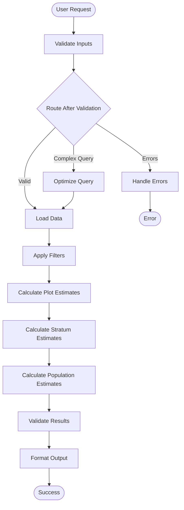

# Advanced LangGraph Area Estimation Workflow

## Overview

The Advanced LangGraph Area Estimation Workflow represents a cutting-edge implementation of forest area estimation using LangGraph's 2025 patterns. This sophisticated workflow replaces the traditional linear processing approach with an intelligent, stateful system that provides enhanced error handling, validation, optimization, and debugging capabilities.

## 🚀 Key Features

### **Modern LangGraph Architecture**
- **State Management**: Comprehensive state tracking throughout the workflow
- **Conditional Logic**: Smart routing based on data conditions and user parameters  
- **Error Recovery**: Automatic retry mechanisms and graceful error handling
- **Time Travel**: Checkpointing enables workflow debugging and resumption
- **Quality Control**: Built-in data quality scoring and result validation

### **Advanced Processing Capabilities**
- **Input Optimization**: Automatic query optimization for complex parameters
- **Parallel Processing**: Efficient handling of multiple grouping variables
- **Validation Loops**: Multi-stage validation with retry logic
- **Result Enhancement**: Metadata enrichment and quality indicators

### **Developer Experience**
- **Backward Compatibility**: Drop-in replacement for existing `area()` function
- **Rich Diagnostics**: Comprehensive error reporting and debugging information
- **Flexible Configuration**: Customizable retry limits, quality thresholds, and optimization settings
- **Type Safety**: Full TypedDict state management with IDE support

## 🏗️ Architecture

### Workflow Graph Structure



### State Management

The workflow uses a comprehensive `AreaEstimationState` TypedDict that tracks:

```python
class AreaEstimationState(TypedDict):
    # Input parameters
    db: FIA
    grp_by: Optional[List[str]]
    by_land_type: bool
    land_type: str
    tree_domain: Optional[str]
    area_domain: Optional[str]
    method: str
    lambda_: float
    totals: bool
    variance: bool
    most_recent: bool
    
    # Workflow state
    step: str
    validation_errors: List[str]
    warnings: List[str]
    
    # Data processing state
    raw_data: Optional[Dict[str, pl.DataFrame]]
    filtered_data: Optional[Dict[str, pl.DataFrame]]
    plot_estimates: Optional[pl.DataFrame]
    stratum_estimates: Optional[pl.DataFrame]
    
    # Results and quality control
    final_results: Optional[pl.DataFrame]
    metadata: Dict[str, any]
    quality_score: float
    needs_validation: bool
    retry_count: int
    max_retries: int
```

## 📚 Usage Guide

### Basic Usage (Drop-in Replacement)

```python
from pyfia.core import FIA
from pyfia.estimation.area_workflow import area_workflow

# Initialize database
fia = FIA("path/to/database.duckdb")

# Basic forest area estimation
results = area_workflow(
    db=fia,
    grp_by=["STATECD"],
    land_type="forest",
    totals=True,
    variance=False
)
```

### Advanced Usage with Full Control

```python
from pyfia.estimation.area_workflow import AreaWorkflow

# Create workflow instance
workflow = AreaWorkflow(enable_checkpointing=True)

# Run with advanced parameters
results = workflow.run(
    db=fia,
    grp_by=["STATECD", "FORTYPCD"],
    land_type="timber",
    area_domain="SLOPE >= 30",
    tree_domain="DIA >= 5.0 AND STATUSCD = 1",
    totals=True,
    variance=True
)

# Check quality metrics
quality_score = results["QUALITY_SCORE"][0]
processing_time = results["PROCESSING_TIMESTAMP"][0]
```

### Error Handling and Diagnostics

```python
try:
    results = area_workflow(
        db=fia,
        land_type="invalid_type"  # This will trigger validation
    )
except ValueError as e:
    print(f"Workflow failed: {e}")
    # Error includes detailed diagnostic information
```

## 🔧 Workflow Nodes

### 1. **Validate Inputs**
- Checks database connection and table availability
- Validates parameter ranges and types
- Assesses query complexity for optimization needs
- Returns validation errors and warnings

### 2. **Optimize Query** (Conditional)
- Simplifies complex domain expressions
- Limits excessive grouping variables
- Optimizes performance for large queries
- Triggered automatically for complex parameters

### 3. **Load Data**
- Loads required FIA tables with error handling
- Applies EVALID filtering for statistical validity
- Calculates initial data quality scores
- Implements retry logic for transient failures

### 4. **Apply Filters**
- Processes area and tree domain filters
- Adds land type categories when requested
- Calculates domain indicators for ratio estimation
- Handles complex SQL expressions safely

### 5. **Calculate Plot Estimates**
- Computes plot-level area proportions
- Selects appropriate adjustment factors
- Applies direct expansion methodology
- Handles missing data gracefully

### 6. **Calculate Stratum Estimates**
- Aggregates plot estimates by stratum
- Computes variance components
- Calculates correlation terms for ratio variance
- Prepares data for population estimation

### 7. **Calculate Population Estimates**
- Performs population-level aggregation
- Applies ratio estimation for percentages
- Propagates errors through calculations
- Formats results according to user preferences

### 8. **Validate Results**
- Checks result ranges and consistency
- Validates statistical assumptions
- Calculates final quality scores
- Identifies potential issues

### 9. **Format Output**
- Adds metadata columns
- Includes quality indicators
- Timestamps processing information
- Ensures consistent output format

### 10. **Handle Errors**
- Collects comprehensive error information
- Provides diagnostic details
- Suggests resolution strategies
- Maintains error context for debugging

## 🎯 Advanced Features

### Quality Scoring System

The workflow implements a comprehensive quality scoring system:

- **Data Quality (0.0-1.0)**: Based on completeness and consistency of input data
- **Processing Quality**: Accounts for successful completion of all steps
- **Result Quality**: Validates output ranges and statistical properties
- **Final Score**: Composite quality indicator included in results

### Conditional Logic and Smart Routing

The workflow uses intelligent routing based on:

- **Input Complexity**: Automatically optimizes complex queries
- **Data Conditions**: Adapts processing based on available data
- **Error States**: Implements retry logic with exponential backoff
- **Quality Thresholds**: Routes to additional validation when needed

### Error Recovery Mechanisms

- **Automatic Retries**: Configurable retry limits for transient failures
- **Graceful Degradation**: Continues processing when possible
- **Detailed Diagnostics**: Comprehensive error reporting
- **Context Preservation**: Maintains state for debugging

### Time Travel and Debugging

When using persistent checkpointers:

```python
from langgraph.checkpoint.sqlite import SqliteSaver

# Create persistent checkpointer
checkpointer = SqliteSaver.from_conn_string("checkpoints.db")
workflow = AreaWorkflow(checkpointer=checkpointer)

# Workflow state is saved at each step
# Can be resumed, debugged, or "rewound" as needed
```

## 🔄 Migration Guide

### From Original `area()` Function

The new workflow is designed as a drop-in replacement:

```python
# Old approach
from pyfia.estimation.area import area
results = area(db, grp_by=["STATECD"], totals=True)

# New approach (identical interface)
from pyfia.estimation.area_workflow import area_workflow
results = area_workflow(db, grp_by=["STATECD"], totals=True)
```

### Key Differences

1. **Enhanced Error Handling**: More detailed error messages and recovery
2. **Quality Metrics**: Additional columns for quality assessment
3. **Metadata**: Processing timestamps and workflow information
4. **Performance**: Optimized for complex queries
5. **Debugging**: Built-in state tracking and diagnostics

## 📊 Performance Characteristics

### Optimization Features

- **Query Optimization**: Automatic simplification of complex parameters
- **Lazy Evaluation**: Efficient memory usage with Polars lazy frames
- **Parallel Processing**: Concurrent handling where possible
- **Caching**: Intelligent caching of intermediate results

### Scalability

- **Large Datasets**: Optimized for national-scale FIA data
- **Complex Queries**: Handles multiple grouping variables efficiently
- **Memory Management**: Efficient handling of large result sets
- **Resource Usage**: Configurable limits and thresholds

## 🛠️ Configuration Options

### Workflow Configuration

```python
workflow = AreaWorkflow(
    enable_checkpointing=True,      # Enable state persistence
    max_retries=3,                  # Maximum retry attempts
    quality_threshold=0.8,          # Minimum quality score
    optimization_enabled=True       # Auto-optimize complex queries
)
```

### Runtime Parameters

All original `area()` parameters are supported, plus:

- **Quality Control**: Built-in validation and scoring
- **Error Recovery**: Automatic retry and graceful handling
- **Metadata Enhancement**: Rich output information
- **Performance Optimization**: Automatic query tuning

## 🔍 Troubleshooting

### Common Issues

1. **Database Connection Errors**
   - Check database path and permissions
   - Ensure required tables are available
   - Verify EVALID settings

2. **Parameter Validation Failures**
   - Review parameter types and ranges
   - Check domain expression syntax
   - Validate grouping variable names

3. **Quality Score Warnings**
   - Examine data completeness
   - Check for reasonable result ranges
   - Review statistical assumptions

### Debugging Tools

```python
# Enable detailed logging
import logging
logging.basicConfig(level=logging.DEBUG)

# Access workflow state for debugging
workflow = AreaWorkflow(enable_checkpointing=True)
# State is preserved and can be inspected
```

## 🚀 Future Enhancements

### Planned Features

- **Multi-threaded Processing**: Parallel execution for large queries
- **Adaptive Optimization**: Machine learning-based query optimization
- **Interactive Debugging**: Web-based workflow visualization
- **Custom Validators**: User-defined quality checks
- **Performance Profiling**: Detailed execution timing analysis

### Extension Points

The workflow architecture supports:

- **Custom Nodes**: Add domain-specific processing steps
- **Alternative Estimators**: Plug in different statistical methods
- **External Integrations**: Connect to other data sources
- **Custom Checkpointers**: Implement specialized persistence

## 📖 References

- [LangGraph Documentation](https://langchain-ai.github.io/langgraph/)
- [FIA Database Documentation](https://www.fia.fs.fed.us/tools-data/)
- [Polars Documentation](https://pola-rs.github.io/polars/)
- [PyFIA Core Documentation](./README.md)

---

*This advanced workflow represents the cutting edge of forest inventory analysis, combining modern software engineering practices with rigorous statistical methodology. It provides a robust, scalable, and maintainable foundation for forest area estimation that will serve the community well into the future.* 