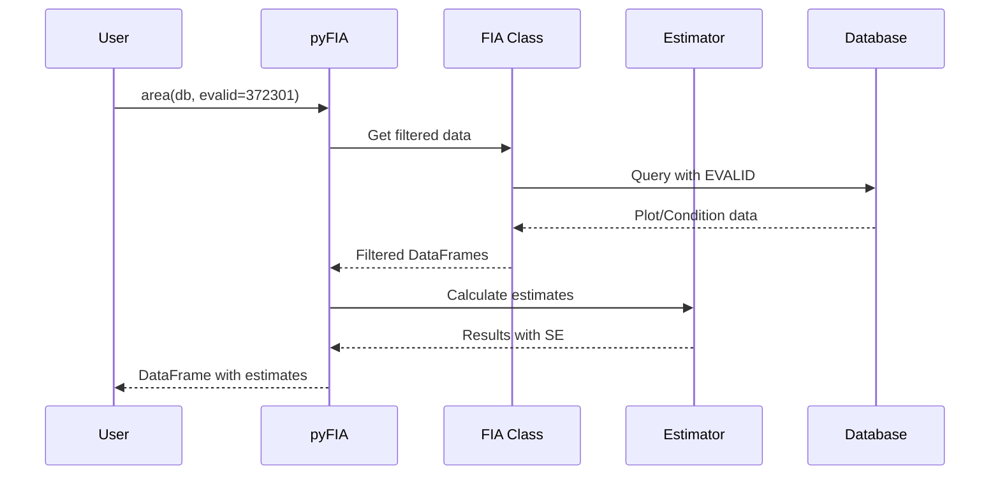

# pyFIA Architecture

## What is pyFIA?

pyFIA is a Python library for analyzing USDA Forest Inventory and Analysis (FIA) data. It provides:
- **Statistical estimation functions** for forest metrics (area, volume, biomass, etc.)
- **rFIA-compatible API** for seamless migration from R
- **High performance** using DuckDB and Polars
- **Proper FIA methodology** with EVALID-based statistical validity

## Core Architecture

```mermaid
graph TB
    %% Entry Points
    subgraph "Entry Layer"
        PY[Python API<br/>import pyfia]
        CLI[pyfia CLI<br/>Direct Functions]
    end
    
    %% Core Components
    subgraph "Core Layer"
        FIA[FIA Class<br/>Database Connection<br/>EVALID Management]
        DR[Data Reader<br/>DuckDB Interface]
    end
    
    %% Processing
    subgraph "Processing Layer"
        EST[Estimation Functions<br/>area, volume, biomass<br/>tpa, mortality, growth]
        FILT[Filters<br/>Domain, EVALID<br/>Grouping, Joins]
        UTILS[Utilities<br/>Statistical Calculations<br/>Stratification]
    end
    
    %% Data
    subgraph "Data Layer"
        DB[(DuckDB<br/>FIA Database)]
    end
    
    %% Direct Path
    PY --> FIA
    CLI --> FIA
    FIA --> EST
    EST --> FILT
    EST --> UTILS
    FIA --> DR
    DR --> DB
    
    style FIA fill:#e74c3c
    style EST fill:#2ecc71
    style DB fill:#34495e
```



## Data Flow

### Direct API Flow


## Key Components

### Core Components

| Component | Purpose | Key Functions |
|-----------|---------|---------------|
| **FIA Class** | Main interface to database | `clipFIA()`, `readFIA()`, `findEvalid()` |
| **Data Reader** | Database abstraction | Handles DuckDB connections and queries |
| **Settings** | Configuration management | Database paths, default options |

### Estimation Functions

| Function | Calculates | Key Features |
|----------|------------|--------------|
| `area()` | Forest land area | By forest type, ownership, size class |
| `biomass()` | Tree biomass | Above/below ground, carbon content |
| `volume()` | Wood volume | Net/gross, merch/sound, board feet |
| `tpa()` | Trees per acre | By species, size, status |
| `mortality()` | Annual mortality | Trees, volume, biomass |
| `growth()` | Annual growth | Net growth accounting for mortality |

### Filter System

| Filter Type | Purpose | Example |
|-------------|---------|---------|
| **EVALID** | Statistical validity | Only use data from one evaluation |
| **Domain** | Tree/area filtering | "DIA >= 5", "OWNGRPCD == 10" |
| **Grouping** | Result aggregation | By species, size class, ownership |
| **Classification** | Tree categorization | Live/dead, growing stock |

## Design Principles

### 1. Statistical Validity First
- **EVALID-based filtering** ensures proper population estimates
- All estimators follow FIA statistical methodology
- Standard errors and confidence intervals included

### 2. Performance Optimized
- **DuckDB** for fast analytical queries
- **Polars** for efficient data manipulation
- Lazy evaluation where possible

### 3. rFIA Compatibility
- **Function signatures** match rFIA where possible
- **Parameter names** follow rFIA conventions
- **Statistical outputs** identical to rFIA

### 4. Modular Design
- Estimation functions are independent
- Filters can be composed
- Easy to add new estimators

### 5. User Friendly
- Consistent function signatures
- Clear parameter names
- Rich documentation and examples

## File Organization

```
src/pyfia/
├── core/           # Database connection, EVALID management
├── estimation/     # Statistical estimation functions
├── filters/        # Data filtering and processing
├── cli/           # Command-line interface
├── database/      # Database utilities and schema
├── models/        # Data models (Pydantic)
└── locations/     # Geographic parsing utilities
```

## Key Concepts

### EVALID System
The heart of FIA's statistical design:
- Groups plots into valid populations
- Ensures proper expansion factors
- Links to specific time periods
- Required for all population estimates

### Stratification
FIA uses post-stratified estimation:
1. Plots assigned to strata
2. Strata have expansion factors
3. Estimates calculated by stratum
4. Combined for population totals

### rFIA Compatibility
pyFIA maintains compatibility with the R rFIA package:
- Same function names and parameters
- Identical statistical methodology
- Matching output structures
- Easy migration path

This architecture provides a solid foundation for forest inventory analysis while maintaining full compatibility with existing rFIA workflows.