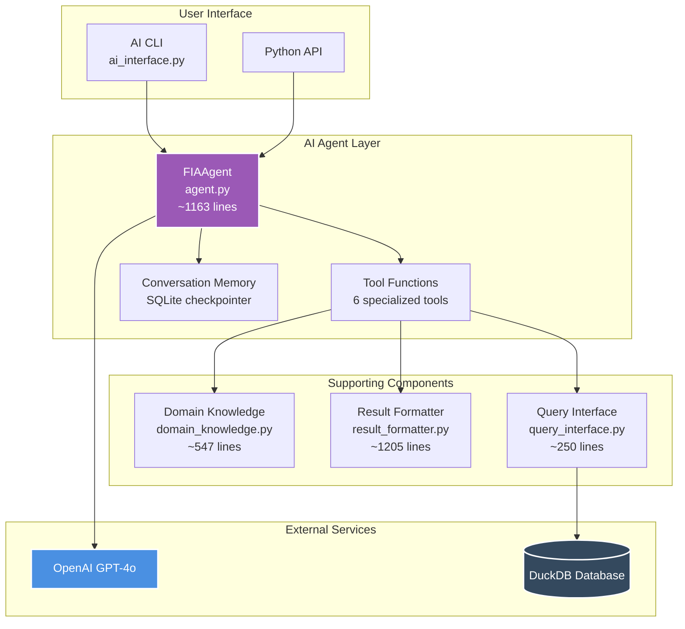
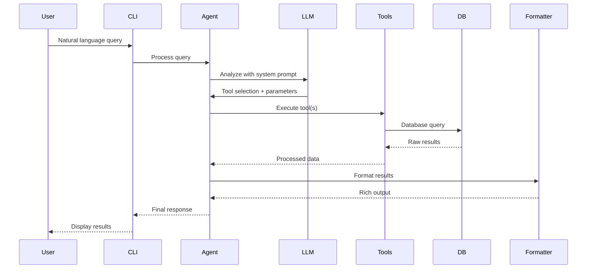
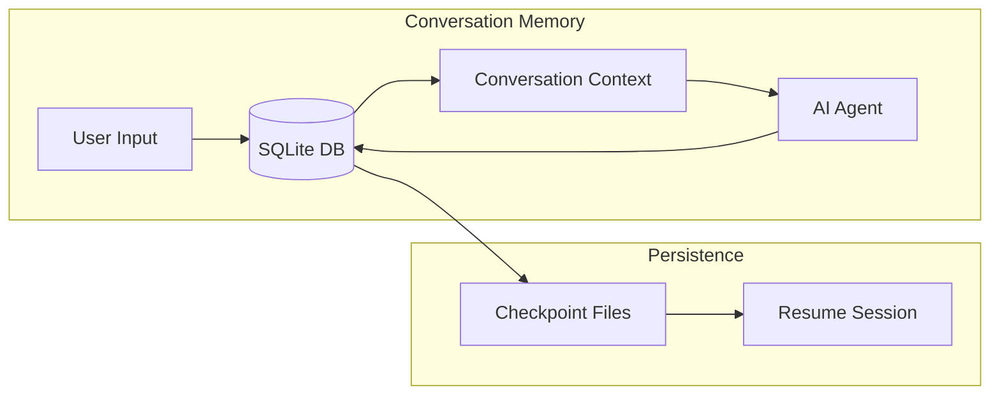
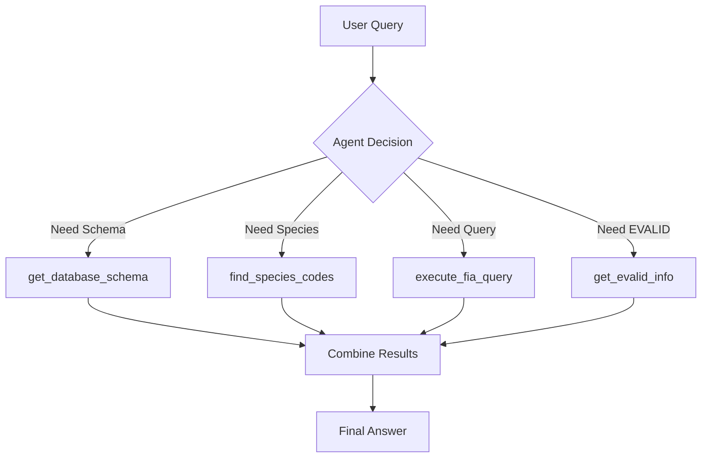
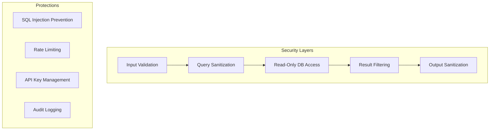

# AI Agent Architecture

This document describes the technical architecture of the PyFIA AI Agent system.

## System Overview

The AI Agent provides a natural language interface to the FIA database through a modern LangGraph-based architecture.



## Core Components

### 1. FIAAgent (agent.py)

The main agent class using LangGraph's ReAct pattern:

```python
class FIAAgent:
    """
    Modern AI agent for FIA natural language queries.
    - Uses create_react_agent from LangGraph
    - Automatic tool selection
    - Built-in conversation memory
    - Human-in-the-loop support
    """
```

**Key Features:**
- **ReAct Pattern**: Reasoning and Acting in interleaved steps
- **Tool Selection**: LLM automatically chooses appropriate tools
- **Memory Management**: Persistent conversation history
- **Error Recovery**: Graceful handling of failures

### 2. Tool Functions

Six specialized tools provide the agent's capabilities:

| Tool | Purpose | Returns |
|------|---------|---------|
| `execute_fia_query` | Run SQL queries safely | Query results as formatted string |
| `get_database_schema` | Retrieve table schemas | Schema information |
| `get_evalid_info` | Get evaluation metadata | EVALID details and stats |
| `find_species_codes` | Resolve species names | Species codes and names |
| `get_state_codes` | State code lookups | State names and codes |
| `count_trees_by_criteria` | Optimized tree counting | Tree count with filters |

### 3. Domain Knowledge (domain_knowledge.py)

Provides FIA expertise to the agent:

```python
# Core knowledge functions
get_fia_concepts()          # FIA terminology
get_common_species()        # Species mappings
get_measurement_units()     # Unit definitions
validate_domain_term()      # Term validation
```

### 4. Result Formatter (result_formatter.py)

Rich terminal output with statistical context:

```python
class FIAResultFormatter:
    """
    Formats query results with:
    - Statistical precision (SE, CI)
    - Reliability ratings
    - Rich tables and panels
    - Export capabilities
    """
```

### 5. Query Interface (query_interface.py)

Direct SQL execution with safety:

```python
class DuckDBQueryInterface:
    """
    Safe database interaction:
    - Read-only access
    - Query validation
    - Result limiting
    - Performance monitoring
    """
```

## Data Flow

### Query Processing Pipeline



### Memory Flow



## LangGraph Integration

### ReAct Agent Pattern

The agent uses LangGraph's modern ReAct implementation:

```python
from langgraph.prebuilt import create_react_agent

agent_executor = create_react_agent(
    model=llm,
    tools=tools,
    state_modifier=system_message,
    checkpointer=checkpointer
)
```

### State Management

LangGraph manages agent state automatically:

1. **Messages**: Full conversation history
2. **Tool Calls**: Track what tools were used
3. **Intermediate Steps**: Reasoning process
4. **Final Answer**: Formatted response

### Tool Execution

Tools are automatically executed by the framework:



## Performance Characteristics

### Response Times

| Operation | Typical Time | Notes |
|-----------|--------------|-------|
| Simple query | 2-5 seconds | Single tool call |
| Complex query | 5-15 seconds | Multiple tools |
| Large results | 10-30 seconds | Formatting overhead |
| First query | +2 seconds | Model loading |

### Resource Usage

- **Memory**: ~500MB base + query results
- **CPU**: Minimal (mostly waiting for API)
- **Network**: OpenAI API calls only
- **Disk**: SQLite checkpoints (~10KB/conversation)

### Optimization Strategies

1. **Query Caching**: LRU cache for repeated queries
2. **Tool Batching**: Execute independent tools in parallel
3. **Result Limiting**: Automatic truncation of large results
4. **Connection Pooling**: Reuse database connections

## Security Model

### Access Control



### Safety Features

1. **Read-Only Access**: Database opened in read-only mode
2. **Query Validation**: All SQL validated before execution
3. **Input Sanitization**: Remove dangerous patterns
4. **Result Limits**: Prevent overwhelming outputs
5. **No System Access**: Tools cannot execute system commands

## Extensibility

### Adding New Tools

Tools are simple Python functions:

```python
def my_custom_tool(param1: str, param2: int) -> str:
    """
    Tool description for the LLM.
    
    Args:
        param1: First parameter
        param2: Second parameter
    
    Returns:
        String result for the agent
    """
    # Implementation
    return formatted_result

# Add to tools list
tools = [...existing_tools, my_custom_tool]
```

### Custom Formatters

Extend result formatting:

```python
class CustomFormatter(FIAResultFormatter):
    def format_special_results(self, data):
        # Custom formatting logic
        return formatted_output
```

### Integration Points

1. **Custom LLMs**: Swap OpenAI for other providers
2. **Alternative Storage**: Replace SQLite checkpointer
3. **External Tools**: Add web search, calculations, etc.
4. **Custom Prompts**: Modify system prompts for behavior

## Deployment Architecture

### Container Deployment

```yaml
services:
  fia-agent:
    image: pyfia-agent:latest
    environment:
      - OPENAI_API_KEY=${OPENAI_API_KEY}
    volumes:
      - ./data:/data
      - ./checkpoints:/checkpoints
    ports:
      - "8000:8000"
```

### Scaling Considerations

1. **Horizontal Scaling**: Each agent instance is independent
2. **Load Balancing**: Route queries to available instances
3. **Shared Storage**: Centralized checkpoint storage
4. **Rate Limiting**: Implement at API gateway level

### Monitoring

Key metrics to track:

- Query volume and patterns
- Response times by query type
- Tool usage statistics
- Error rates and types
- Token usage (API costs)

## Future Architecture

### Planned Enhancements

1. **Streaming Responses**: Real-time output as processing occurs
2. **Multi-Modal Input**: Support for images/charts
3. **Async Processing**: Non-blocking query execution
4. **Plugin System**: Dynamic tool loading
5. **Federation**: Query multiple databases

### Research Directions

- **Local LLMs**: On-premise deployment options
- **Fine-Tuning**: Domain-specific model training
- **Query Planning**: Multi-step query optimization
- **Caching Layer**: Intelligent result caching

## Summary

The PyFIA AI Agent architecture provides:

- **Modern AI Stack**: Latest LangGraph patterns
- **Clean Separation**: Tools, knowledge, and formatting
- **Extensible Design**: Easy to add capabilities
- **Production Ready**: Security, monitoring, scaling
- **User Friendly**: Natural language with rich output

The architecture balances sophistication with simplicity, making forest data analysis accessible while maintaining scientific rigor.