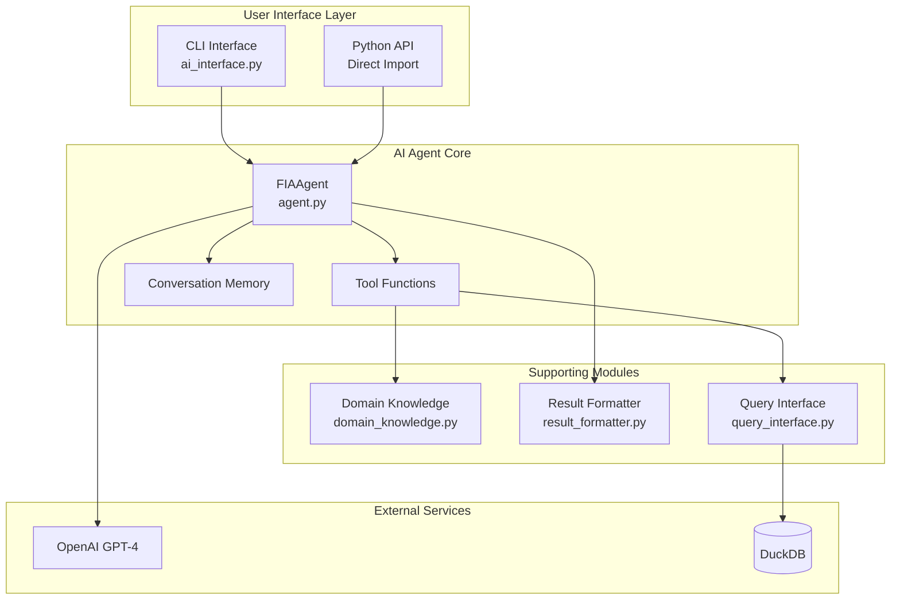
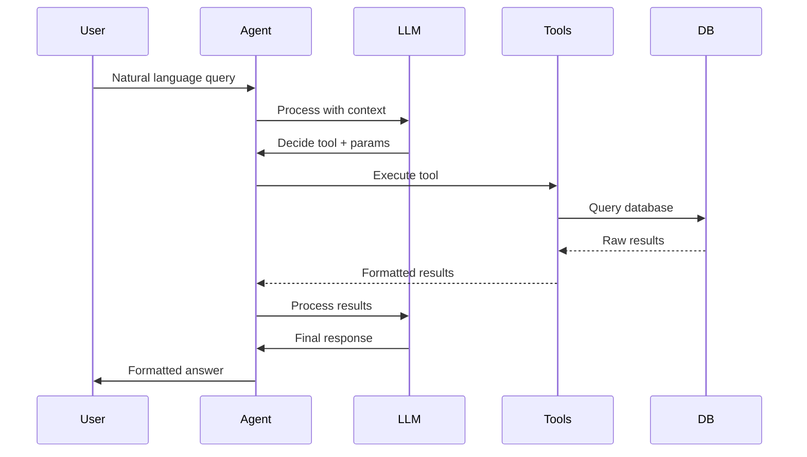

# PyFIA AI Agent Developer Guide

This guide covers the technical implementation details of the PyFIA AI Agent for developers who want to understand, extend, or customize the system.

## Architecture Overview

### System Components



### Core Design Principles

1. **ReAct Pattern**: Uses LangGraph's create_react_agent for reasoning and acting
2. **Tool-Based**: All capabilities exposed as discrete tool functions
3. **Stateless Tools**: Each tool is independent and stateless
4. **Memory Management**: Built-in conversation persistence
5. **Type Safety**: Full type hints throughout the codebase

## Implementation Details

### FIAAgent Class

Located in `src/pyfia/ai/agent.py`:

```python
class FIAAgent:
    """
    Main AI agent for natural language FIA queries.
    Uses LangGraph's create_react_agent pattern.
    """
    
    def __init__(
        self,
        db_path: str,
        api_key: Optional[str] = None,
        model_name: str = "gpt-4o",
        temperature: float = 0,
        verbose: bool = False,
        enable_human_approval: bool = False,
        checkpoint_dir: Optional[str] = None
    ):
        """Initialize the FIA agent with database and AI configuration."""
```

### Tool Development

#### Tool Structure

Each tool follows this pattern:

```python
def tool_name(parameter1: str, parameter2: Optional[int] = None) -> str:
    """
    Clear, concise description of what this tool does.
    
    Args:
        parameter1: Description of first parameter
        parameter2: Optional parameter with default
        
    Returns:
        Formatted string result for the LLM
    """
    try:
        # Tool implementation
        result = perform_operation(parameter1, parameter2)
        
        # Format result for LLM consumption
        return format_result(result)
        
    except Exception as e:
        return f"Error: {str(e)}"
```

#### Available Tools

1. **execute_fia_query**: Execute SQL queries safely
2. **get_database_schema**: Retrieve table schemas
3. **get_evalid_info**: Get evaluation metadata
4. **find_species_codes**: Species name resolution
5. **get_state_codes**: State code lookups
6. **count_trees_by_criteria**: Optimized tree counting

### Adding New Tools

1. **Define the function** in `agent.py`:

```python
def calculate_growth_rate(
    evalid1: int,
    evalid2: int,
    species_code: Optional[int] = None
) -> str:
    """
    Calculate growth rate between two evaluations.
    
    Args:
        evalid1: First evaluation ID
        evalid2: Second evaluation ID  
        species_code: Optional species filter
        
    Returns:
        Formatted growth rate analysis
    """
    # Implementation
```

2. **Add to tools list** in `_create_agent()`:

```python
tools = [
    execute_fia_query,
    get_database_schema,
    # ... other tools ...
    calculate_growth_rate,  # Add new tool
]
```

3. **Test the tool**:

```python
def test_growth_rate_tool():
    agent = FIAAgent("test.duckdb")
    result = agent.query(
        "Calculate growth rate between evaluations 372201 and 372301"
    )
    assert "growth rate" in result.lower()
```

### Query Processing Pipeline



### Memory and State Management

#### Conversation Memory

The agent uses LangGraph's built-in memory:

```python
# Memory is automatically managed by create_react_agent
agent_executor = create_react_agent(
    llm, 
    tools,
    state_modifier=system_message,
    checkpointer=checkpointer  # Enables persistence
)
```

#### Checkpointing

Enable conversation persistence:

```python
from langgraph.checkpoint.sqlite import SqliteSaver

# Create checkpoint directory
checkpoint_dir = Path("./checkpoints")
checkpoint_dir.mkdir(exist_ok=True)

# Initialize checkpointer
checkpointer = SqliteSaver.from_conn_string(
    str(checkpoint_dir / "checkpoints.db")
)
```

### Result Formatting

The `result_formatter.py` module provides rich formatting:

```python
from pyfia.ai.result_formatter import FIAResultFormatter

formatter = FIAResultFormatter(
    confidence_level=0.95,
    include_emojis=True,
    use_rich=True
)

formatted = formatter.format_results(
    df=results_dataframe,
    query_info={
        "query_type": "tree_count",
        "filters": {"status": "live"},
        "evalid": 372301
    }
)
```

### Domain Knowledge Integration

The `domain_knowledge.py` module provides FIA expertise:

```python
from pyfia.ai.domain_knowledge import (
    get_fia_concepts,
    get_common_species,
    get_measurement_units,
    validate_domain_term
)

# Use in system prompts
concepts = get_fia_concepts()
system_prompt = f"""
You are an expert in Forest Inventory Analysis.
Key concepts you understand: {concepts}
"""
```

## Extension Points

### Custom Tools

Create specialized tools for your use case:

```python
# Custom tool for specific analysis
def analyze_fire_risk(
    state_code: int,
    min_biomass: float = 50.0
) -> str:
    """Analyze fire risk based on biomass density."""
    # Custom implementation
    
# Add to agent
agent = FIAAgent("database.duckdb")
agent.tools.append(analyze_fire_risk)
```

### Custom Formatters

Extend result formatting:

```python
class CustomFormatter(FIAResultFormatter):
    def format_spatial_results(self, gdf):
        """Format GeoPandas results."""
        # Custom spatial formatting
```

### Integration Patterns

#### Batch Processing

```python
class BatchFIAAgent(FIAAgent):
    def batch_query(self, queries: List[str]) -> List[str]:
        """Process multiple queries efficiently."""
        results = []
        for query in queries:
            result = self.query(query)
            results.append(result)
        return results
```

#### Async Operations

```python
import asyncio
from typing import List

async def async_query(agent: FIAAgent, query: str) -> str:
    """Async wrapper for queries."""
    loop = asyncio.get_event_loop()
    return await loop.run_in_executor(
        None, agent.query, query
    )

async def parallel_queries(
    agent: FIAAgent, 
    queries: List[str]
) -> List[str]:
    """Run queries in parallel."""
    tasks = [async_query(agent, q) for q in queries]
    return await asyncio.gather(*tasks)
```

## Testing

### Unit Tests

Test individual components:

```python
import pytest
from pyfia.ai.agent import FIAAgent

def test_species_lookup():
    agent = FIAAgent("test.duckdb")
    # Test species code lookup
    result = find_species_codes("oak")
    assert any("Quercus" in r for r in result)

def test_evalid_validation():
    agent = FIAAgent("test.duckdb")
    info = get_evalid_info(372301)
    assert info["state"] == "North Carolina"
```

### Integration Tests

Test full query processing:

```python
def test_full_query_pipeline():
    agent = FIAAgent("test.duckdb")
    result = agent.query(
        "How many live oak trees are in North Carolina?"
    )
    # Verify response contains expected elements
    assert "trees" in result.lower()
    assert any(x in result for x in ["oak", "Quercus"])
```

### Performance Testing

```python
import time

def test_query_performance():
    agent = FIAAgent("test.duckdb")
    
    start = time.time()
    result = agent.query("Complex analysis query...")
    duration = time.time() - start
    
    assert duration < 30  # Should complete in 30s
```

## Debugging

### Enable Verbose Mode

```python
# See all LangGraph operations
agent = FIAAgent("database.duckdb", verbose=True)

# Or set environment variable
os.environ["LANGCHAIN_VERBOSE"] = "true"
```

### Trace Execution

```python
# Enable LangSmith tracing
os.environ["LANGCHAIN_TRACING_V2"] = "true"
os.environ["LANGCHAIN_API_KEY"] = "your-api-key"
```

### Common Issues

1. **Tool Not Found**
   - Ensure tool is added to tools list
   - Check function has proper docstring

2. **Memory Not Persisting**
   - Verify checkpoint_dir is writable
   - Use consistent thread_id

3. **Slow Queries**
   - Add database indexes
   - Optimize tool implementations
   - Use query result caching

## Performance Optimization

### Query Caching

```python
from functools import lru_cache

@lru_cache(maxsize=1000)
def cached_species_lookup(species_name: str):
    """Cache species lookups."""
    return find_species_codes(species_name)
```

### Database Optimization

```python
# Add indexes for common queries
def optimize_database(db_path: str):
    conn = duckdb.connect(db_path)
    
    # Index for species queries
    conn.execute("""
        CREATE INDEX IF NOT EXISTS idx_tree_spcd 
        ON TREE(SPCD)
    """)
    
    # Index for evaluation queries
    conn.execute("""
        CREATE INDEX IF NOT EXISTS idx_plot_evalid 
        ON PLOT(EVALID)
    """)
```

### Concurrent Processing

```python
from concurrent.futures import ThreadPoolExecutor

class ConcurrentFIAAgent(FIAAgent):
    def __init__(self, *args, max_workers=4, **kwargs):
        super().__init__(*args, **kwargs)
        self.executor = ThreadPoolExecutor(max_workers)
    
    def parallel_tools(self, tool_calls):
        """Execute multiple tools in parallel."""
        futures = [
            self.executor.submit(tool, *args)
            for tool, args in tool_calls
        ]
        return [f.result() for f in futures]
```

## Security Considerations

### Input Validation

```python
def validate_user_input(query: str) -> bool:
    """Validate user queries for safety."""
    # Check for SQL injection attempts
    dangerous_patterns = [
        "DROP", "DELETE", "UPDATE", "INSERT",
        "CREATE", "ALTER", "--", "/*", "*/"
    ]
    
    query_upper = query.upper()
    return not any(p in query_upper for p in dangerous_patterns)
```

### Rate Limiting

```python
from datetime import datetime, timedelta
from collections import defaultdict

class RateLimitedAgent(FIAAgent):
    def __init__(self, *args, **kwargs):
        super().__init__(*args, **kwargs)
        self.query_times = defaultdict(list)
        self.rate_limit = 10  # queries per minute
    
    def check_rate_limit(self, user_id: str) -> bool:
        now = datetime.now()
        minute_ago = now - timedelta(minutes=1)
        
        # Clean old entries
        self.query_times[user_id] = [
            t for t in self.query_times[user_id]
            if t > minute_ago
        ]
        
        # Check limit
        if len(self.query_times[user_id]) >= self.rate_limit:
            return False
            
        self.query_times[user_id].append(now)
        return True
```

## Deployment

### Docker Configuration

```dockerfile
FROM python:3.11-slim

WORKDIR /app

# Install dependencies
COPY requirements.txt .
RUN pip install -r requirements.txt

# Copy application
COPY src/ src/
COPY data/ data/

# Set environment variables
ENV PYTHONPATH=/app
ENV OPENAI_API_KEY=${OPENAI_API_KEY}

# Run the agent
CMD ["python", "-m", "pyfia.cli.ai_interface", "/data/fia.duckdb"]
```

### Production Considerations

1. **API Key Management**: Use secrets management service
2. **Database Access**: Read-only replicas for safety
3. **Monitoring**: Track query patterns and errors
4. **Scaling**: Use connection pooling for database
5. **Caching**: Implement Redis for query results

## Contributing

### Development Setup

```bash
# Clone repository
git clone https://github.com/your-username/pyfia
cd pyfia

# Create virtual environment
python -m venv venv
source venv/bin/activate

# Install in development mode
pip install -e ".[dev,langchain]"

# Run tests
pytest tests/test_ai_agent.py
```

### Code Style

- Follow PEP 8 guidelines
- Use type hints for all functions
- Write comprehensive docstrings
- Add unit tests for new features

### Pull Request Process

1. Create feature branch
2. Implement changes with tests
3. Update documentation
4. Submit PR with description

## Resources

- [LangChain Documentation](https://python.langchain.com/)
- [LangGraph Guide](https://langchain-ai.github.io/langgraph/)
- [OpenAI API Reference](https://platform.openai.com/docs/)
- [DuckDB Python API](https://duckdb.org/docs/api/python)