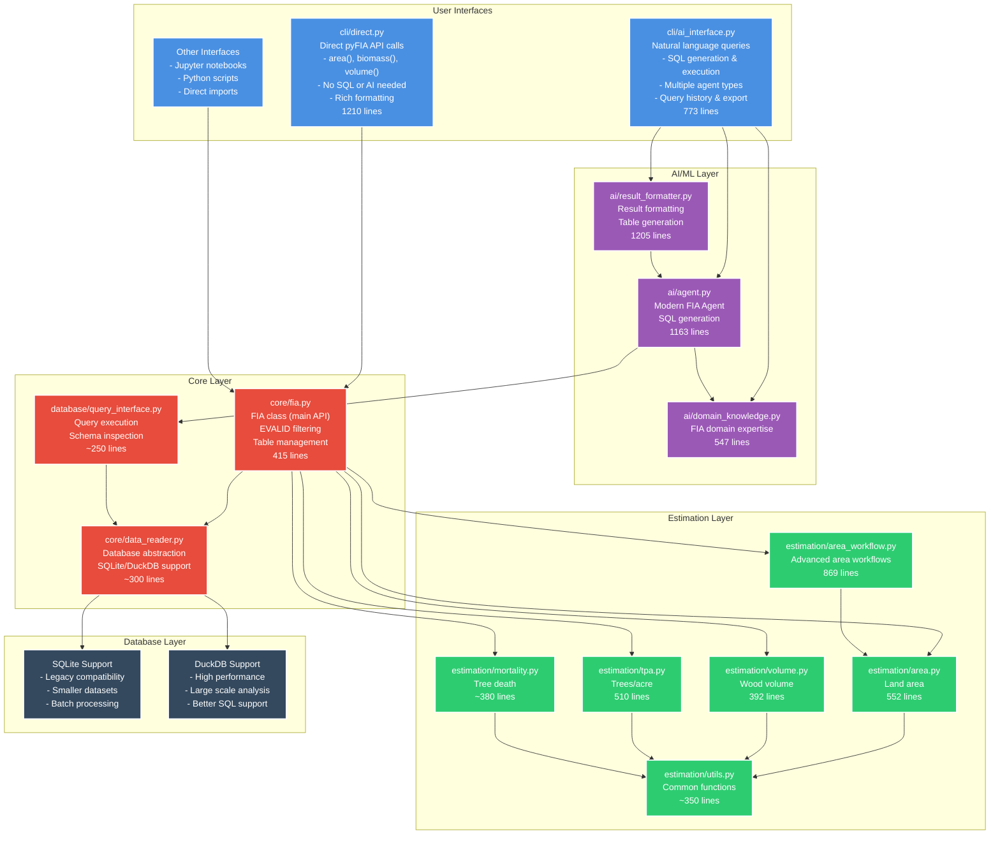
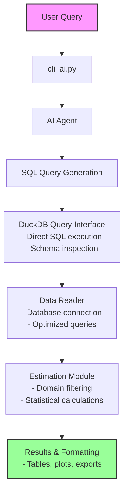
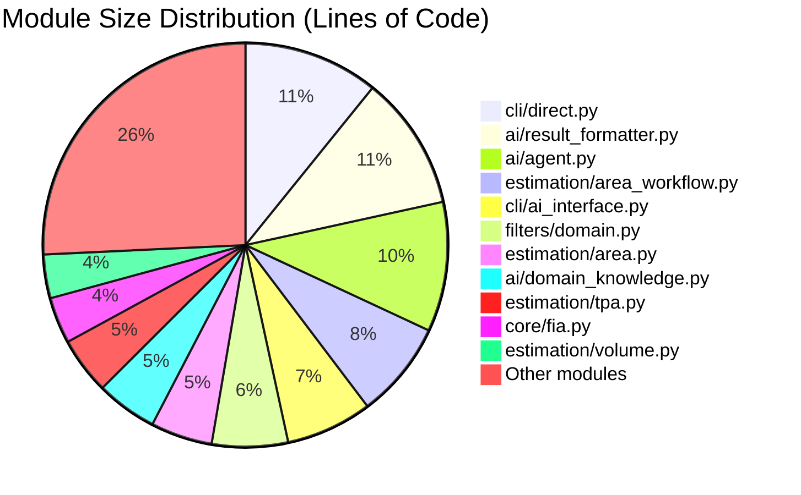
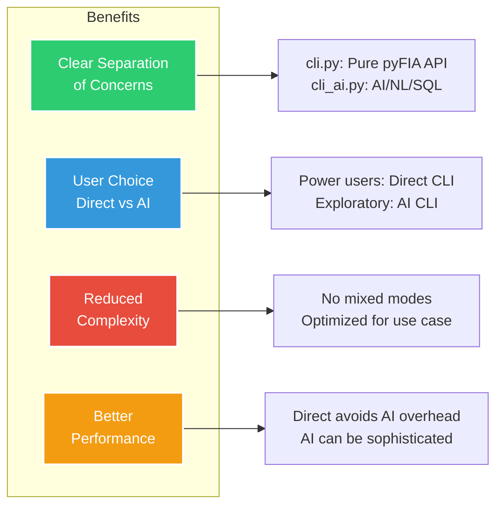

# pyFIA Architecture

## System Overview



## Data Flow - Two Distinct Paths

### Path 1: Direct Programmatic Access

```mermaid
graph TD
    User[User Input] --> CLI[cli.py]
    CLI --> FIA[FIA Core<br/>- fia.area&#40;bySpecies=True&#41;<br/>- fia.biomass&#40;component='AG'&#41;<br/>- fia.volume&#40;volType='NET'&#41;]
    FIA --> Est[Estimation Modules<br/>- area.py, biomass.py, etc.<br/>- Direct statistical methods]
    Est --> DB[Database Layer]
    DB --> Results[Results & Formatting]

    style User fill:#f9f,stroke:#333,stroke-width:2px
    style Results fill:#9f9,stroke:#333,stroke-width:2px
```



### Path 2: AI-Enhanced Query Access



## Code Duplication Analysis

```mermaid
graph LR
    subgraph "High Duplication (5x)"
        TF[Tree/Area Filtering<br/>_apply_tree_filters&#40;&#41;<br/>_apply_area_filters&#40;&#41;]
        style TF fill:#ff6b6b,stroke:#333,stroke-width:2px
    end

    subgraph "Medium Duplication (4x)"
        GL[Grouping Logic<br/>Size class creation<br/>Species grouping]
        ST[Stratification<br/>Plot-stratum-EU calculations<br/>Adjustment factors]
        style GL fill:#ffd93d,stroke:#333,stroke-width:2px
        style ST fill:#ffd93d,stroke:#333,stroke-width:2px
    end

    subgraph "Low Duplication (3x)"
        CH[CLI Connection Handling]
        DS[Database Schema Display]
        PI[Progress Indicators]
        style CH fill:#95e1d3,stroke:#333,stroke-width:2px
        style DS fill:#95e1d3,stroke:#333,stroke-width:2px
        style PI fill:#95e1d3,stroke:#333,stroke-width:2px
    end

    subgraph "Unique Code"
        CF[Core FIA logic]
        CI[Cognee integration]
        SF[Statistical formulas]
        style CF fill:#6bcf7f,stroke:#333,stroke-width:2px
        style CI fill:#6bcf7f,stroke:#333,stroke-width:2px
        style SF fill:#6bcf7f,stroke:#333,stroke-width:2px
    end
```



## Dependency Graph

```mermaid
graph TB
    %% External Dependencies
    subgraph External["External Dependencies"]
        Polars[Polars<br/>DataFrames]
        DuckDB[DuckDB<br/>Database]
        Rich[Rich<br/>CLI Formatting]
        LangChain[LangChain<br/>AI Framework]
        Cognee[Cognee<br/>Memory]
    end

    %% Direct Path
    subgraph DirectPath["Direct Path Dependencies"]
        Polars --> EstModules[Estimation<br/>Modules]
        DuckDB --> DataReaderDirect[data_reader.py]
        Rich --> CLIDirect[cli.py<br/>&#40;direct&#41;]
        DataReaderDirect --> CorePy[core.py]
        EstModules --> CorePy
        CorePy --> CLIDirect
    end

    %% AI Path
    subgraph AIPath["AI Path Dependencies"]
        DuckDB --> QueryInt[duckdb_query<br/>_interface.py]
        Rich --> CLIAI[cli_ai.py]
        LangChain --> AIAgents[AI agents<br/>ai_*.py]
        Cognee --> CogneeAgent[cognee_fia<br/>_agent.py]
        QueryInt --> CLIAI
        AIAgents --> CLIAI
        CogneeAgent --> CLIAI
    end

    %% Shared Core
    subgraph SharedCore["Shared Core"]
        EstUtils[estimation_utils.py<br/>Used by all estimation modules]
        CoreShared[core.py<br/>Used by cli.py and estimation modules]
        DataReaderShared[data_reader.py<br/>Used by core.py]
    end

    EstModules --> EstUtils
    CorePy --> CoreShared
    CoreShared --> DataReaderShared

    style Polars fill:#4a90e2,stroke:#fff,stroke-width:2px,color:#fff
    style DuckDB fill:#4a90e2,stroke:#fff,stroke-width:2px,color:#fff
    style Rich fill:#4a90e2,stroke:#fff,stroke-width:2px,color:#fff
    style LangChain fill:#4a90e2,stroke:#fff,stroke-width:2px,color:#fff
    style Cognee fill:#4a90e2,stroke:#fff,stroke-width:2px,color:#fff
```



## Module Size Analysis



## Refactoring Opportunities

### 1. Create Base Classes

```python
# estimation_base.py
class EstimationBase:
    def apply_filters()
    def calculate_plot_level()
    def calculate_stratum_level()
    def calculate_population_level()

# Each module inherits
class AreaEstimation(EstimationBase):
    def specific_calculations()
```

### 2. Consolidate AI Agents

```python
# Single flexible agent
class FIAAgent:
    def __init__(self, memory_backend='basic'):
        # Support basic, enhanced, cognee
```

### 3. Two-CLI Architecture Benefits



### 4. Extract Common Patterns

- Move all filter functions to `estimation_utils`
- Create `GroupingMixin` for size/species grouping
- Create `StratificationMixin` for common calculations

## Summary

The pyFIA architecture implements a clean separation between:

1. **Direct API Access** - Fast, programmatic access to FIA statistical methods
2. **AI-Enhanced Access** - Natural language queries with SQL generation

This dual-path architecture allows users to choose the appropriate interface for their needs while maintaining code organization and performance.

**Total Lines**: ~10,200 (after removing deprecated files)
**Potential After Refactor**: ~8,000-8,500 (20% reduction)