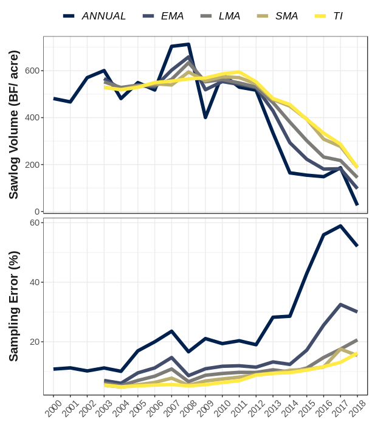

# Alternative design-based estimators

The FIA program conducts annual inventories (panels) within each state. In the eastern US, this is most often a series of 5 annual, spatially unbiased inventories within each sampling cycle. This panel structure allows the FIA program to improve the precision of status and change estimates by leveraging previously collected data within an inventory cycle (e.g., estimates for 2015 may include data from annual inventories conducted from 2010-2015). There are many methods available for combining annual panels using alternative weighting schemes, and we have implemented a few in `rFIA`. Implementing these alternative design-based estimators is easy! Simply modify the `method` argument in any estimator function (e.g., `tpa()`, `biomass()`).

* __Temporally Indifferent__ (`method = 'TI'`): This is the flagship estimator used by the FIA program, seen in tools like `EVALIDator`, and implemented by default in `rFIA`. The temporally indifferent method assumes that all annual panels within an inventory cycle were collected simultaneously in the reporting year (i.e., one large, periodic inventory). While the Temporally Indifferent estimator can be great for reducing variance on a point estimate, it introduces temporal lag bias and smoothing that limits its utility for change detection.

* __Annual__ (`method = 'ANNUAL'`): The annual estimator returns estimates produced directly from annual panels (no panel combination). Thus only data that is measured in a given year is used to produce estimates for that year. This method will produce estimates with higher variance (loss of precision) as we forgo the opportunity to leverage previous information (increase sample size), although it may be the best option for assessing inter-annual variation and temporal trends. NOTE: This estimator may produce estimates with temporally cyclical structure because of repeat observations of individual annual panels between inventory cycles. For example if plots are measured on 5 year cycles beginning in 2005, the same plots measured in 2005 will be remeasured in 2010, 2015, 2020 and onward. Hence, corresponding annual panel estimates are likely to be similar to one another, potentially producing results with some odd temporal structure. 

* __Simple Moving Average__ (`method = 'SMA'`): The simple moving average estimator (SMA) is similar to the TI, but rather than treating all plots in an inventory cycle as one large periodic inventory, the SMA instead produces estimates from annual panels and subsequently combines those panels with equal weight. Hence, the SMA is in a sense "temporally-indifferent" by weighting recent information equal to old information (think annual panels here), and  represents the _average state_ of the population over the temporal frame of sampling (length of an inventory cycle). A key difference between the SMA and TI: the SMA effectively takes into account the sample size of annual panels, of particular importance for the associated variance estimator.

* __Linear Moving Average__ (`method = 'LMA'`): The linear moving average estimator (LMA) falls in the middle ground between the SMA and annual estimators, leveraging all annual panels within an inventory cycle to produce estimates, although giving higher weight to more recent panels. The relative weights applied to each panel declines linearly as a function of time since measurement. This reduces the effective sample size of the inventory, and hence the LMA tends to be less _precise_ than the SMA (i.e., higher variance). However, a temporally decaying weighting scheme means the LMA tends to have higher _temporal specificity_ than the SMA (less temporal smoothing). 

* __Exponential Moving Average__ (`method = 'EMA'`): The exponential moving average estimator (EMA) is the most flexible design-based estimator implemented in `rFIA`. The EMA is similar to the LMA in that it gives higher weight to more recent panels, however these weights decline exponentially as a function of time since measurement. We can control the rate of this decay with a parameter called `lambda` (0.5 by default, ranges form 0-1). Low lambda values will place higher weight on more recent observations, so as lambda approaches 0, the EMA will approach the annual estimator. In contrast, high lambda values spread weights more evenly across the inventory cycle, so as lambda approaches 1, the EMA will approach the SMA. We face the same trade-off here as we do in the LMA: precision vs. temporal specificity. That is, as `lambda` increases, we gain precision (reduce variance) and lose temporal specificity (increase temporal smoothing). 

If a vector of `lambda` values is specified in any `rFIA` estimator function (e.g., `lambda = seq(0.05, 0.95, by 0.05)), estimates will be returned for each unqiue value of `lambda` (takes nearly the same amount of run-time).

## Visuals

For a visual example of the estimators described above, check out the following figure from the [introductory `rFIA` publication](https://doi.org/10.1016/j.envsoft.2020.104664), where we estimate changes in live ash volume in the lower peninsula of Michigan following the invasion of emerald ash borer: 

# Model-based estimators

We are hoping to expand `rFIA` functionality for implementing a variety of model-based estimators. In particular, a special focus is on developing more seamless tools for model-based small area estimation following approaches outlined in, e.g., [Stanke et al. 2022](https://www.frontiersin.org/journals/forests-and-global-change/articles/10.3389/ffgc.2022.745874/full) and [Shannon et al. 2025](https://iopscience.iop.org/article/10.1088/1748-9326/ad9e07/meta). Stay tuned!
