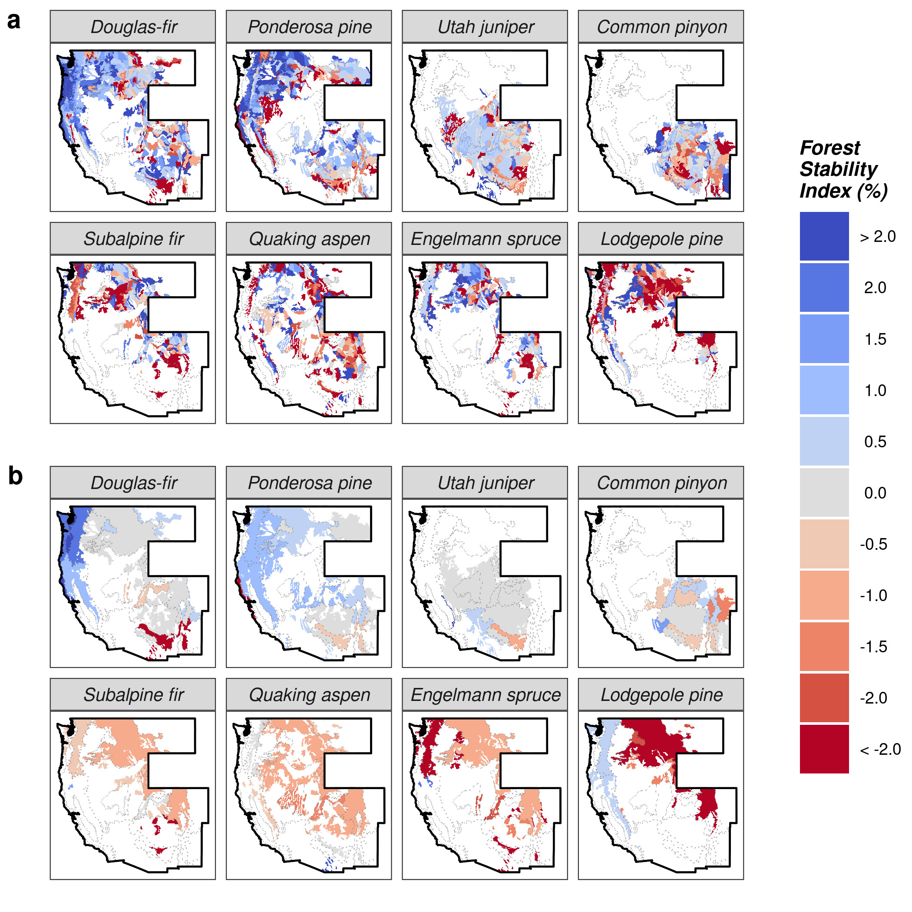

Check out our [publication in Nature Communications](https://www.nature.com/articles/s41467-020-20678-z), where we develop a new standardized forest demographic index and use it to quantify trends in tree population dynamics over the last two decades in the western United States!

{width=100%}

## Abstract

Changing forest disturbance regimes and climate are driving accelerated tree mortality across temperate forests. However, it remains unknown if elevated mortality has induced decline of tree populations and the ecological, economic, and social benefits they provide. Here, we develop a standardized forest demographic index and use it to quantify trends in tree population dynamics over the last two decades in the western United States. The rate and pattern of change we observe across species and tree size-distributions is alarming and often undesirable. We observe significant population decline in a majority of species examined, show decline was particularly severe, albeit size-dependent, among subalpine tree species, and provide evidence of widespread shifts in the size-structure of montane forests. Our findings offer a stark warning of changing forest composition and structure across the western US, and suggest that sustained anthropogenic and natural stress will likely result in broad-scale transformation of temperate forests globally.

